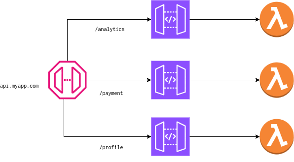

## Spec

```yaml

name: TOPOLOGY-NAME

routes:
  NAME_OR_PATH:
    gateway: <String>
    vertical: <String>
    authorizer: <String>
    method: POST|GET|DELETE|PUT
    path: <String>
    async: false
    function: <String>
    state: <String>
    queue: <String>
    event: <String>
    request_template: <String>
    response_template: <String>
    stage: <String>
    stage_variables: <Map>
    CORS:
      methods: [GET, POST]
      origins: ["*"]
      headers: [String]

```

Gateway is optional and required if you need to use an existing gateway. By default, tc creates a gateway with the name of the topology (namespace).

## Authorizer

### Function Authorizer

```yaml
name: TOPOLOGY-NAME

routes:
  /foo:
    method: POST
    authorizer: my-authorizer
    function: function1

functions:
  my-authorizer:
    uri: ../my-other/authorizer
```

### Cognito Authorizer

We could also specify a cognito authorizer

```yaml
routes:
  /api/foo:
    method: GET
    authorizer: cognito
    function: f1
```

## Patterns


### Request-response

By default, the entity targets are synchronous.

```yaml

name: request-response

routes:
  /api/ping:
    method: GET
    function: fetcher
```

### Async request-response

```yaml
routes:
  /api/message:
    method: POST
    async: true
    event: GetMessages

events:
  GetMessages:
    producer: fetcher
    channel: messages

channels:
  messages:
	function: default

```

### Queued Requests

```yaml
routes:
  /foo:
    authorizer: my-authorizer
    method: POST
    queue: foo-queue

queues:
  foo-queue:
    mode: FIFO
    function: function1

```

## Route Verticals

Route Vertical is an abstraction to map APIs to separate Gateways, yet using a common custom domain. For example, in the following diagram, we'd like api.myapp.com to be served by separate domain verticals (gateways) with optionally different Gateway configurations.



The diagram can be described in a topology.yml file:

```yaml
name: example-routes
infra: ./infra

routes:
  /analytics/timeseries:
    method: GET
    vertical: analytics
    function: f1
  /payment/process:
    method: GET
    vertical: payment
    function: f2
  /profile/contact:
    method: GET
    vertical: profile
    function: f3

```
Now let's say we want to route these verticals (analytics, payment and profile) to different sandboxes (separate topologies or DAG of entities). We can represent that in `{INFRA_DIR}/routes.json`

```
{
  "verticals": {
    "api.myapp.com": {
      "payment_beta": ["/payment"],
      "analytics_alpha": ["/analytics"],
      "profile_stable": ["/profile"]
    }
  },
  "domains": {
    "default": {
      "stable": "api.{{env}}.myapp.com"
    }
  }
}
```
Here the `payment_beta`, `analytics_alpha` and `profile_stable` are seprate sandboxes with each being it's own function or topology.

#### Constraints

1. Path prefixes in routes.json should not contain a trailing '/'.
2. The custom domain to route should also be present in the domains block in routes.json. tc will manage the certs and zone records.
3. It is also not possible to have a route same as the path prefix. For example `/payment` route in topology.yml and `/payment` path prefix in routes.json are invalid. However, `/payment/process` and `/payment` path prefix (vertical) are valid.

Example: [examples/routes](https://github.com/tc-functors/tc/tree/main/examples/routes)

## Configuration

### Sandbox-specific configuration

We can set custom domains in a configuration, typically in INFRA_DIR/<topology>/routes.json

```json
{
    "domains": {
        "default": {
            "stable": "service.mydomain.com",
            "dev": "dev.mydomain.com"
        },
        "prod": {
            "stable": "prod.mydomain.com"
        }
    },
    "throttling": {
        "default": {
            "stable": {
                "burst_limit": 120,
                "rate_limit": 90
            },
            "dev": {
                "burst_limit": 120,
                "rate_limit": 90
            }
        }
    }
}

```


### Default configuration

At times, we may want to define the defaults for all the routes. For example:

```yaml
routes:
  default:
    doc-only: true
    gateway: my-gateway
    CORS:
      methods: [GET, POST]
      origins: ["*"]
      headers: [String]

  /foo:
    method: GET

  /bar:
    method: GET

```
Here we set the defaults for all routes in the topology. The individual route can still override the default.
