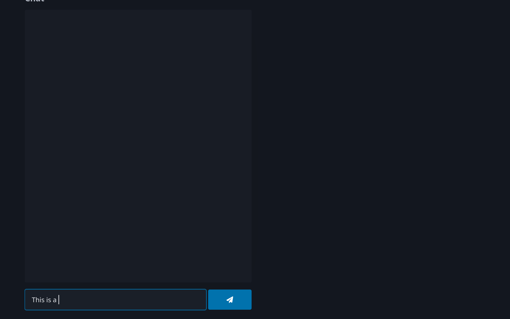

This example shows a simple serverless chat application.

```
name: example-chat

channels:
  my-channel:
    handler: default

pages:
  app:
    bucket: some-s3-bucket-name
    dir: .
    dist: dist
    config_template: index.html
```


