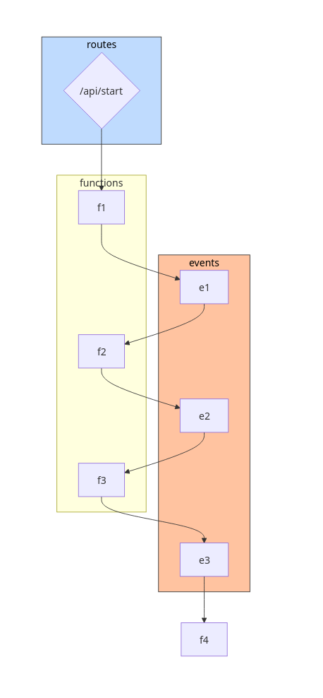
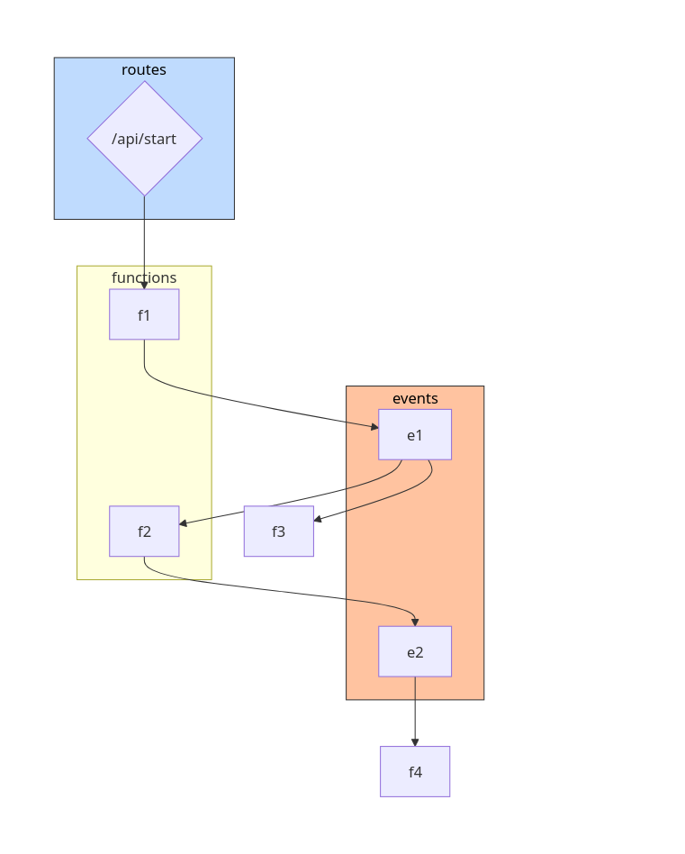

This is a rough draft.

The goal of this example is to demonstrate simple composition of events and functions.

While we can compose functions directly without any intermediate entity (Events), there are cases where the choreography can be sophisticated and Events are well suited for such orchestration.

The following topology shows a simple evented choreography where the functions f2, f3, f4 are invoked via events. This is a classic example of using functions and events. Note the functions themselves don't need to trigger any events directly. tc will implicitly wire things up to trigger the target entities.

```yaml
name: example-evented

routes:
  /api/start:
    function: f1
    method: POST

events:
  e1:
    functions: f2
  e2:
    function: f3
  e3:
    function: f4

functions:
  f1:
    event: e1
  f2:
    event: e2
  f3:
    event: e3

```

The following is a better representation of an evented topology where multiple functions (f1, f2) get invoked by an event.




```yaml
name: example-evented

routes:
  /api/start:
    function: f1
    method: POST

events:
  e1:
    functions:
      - f2
      - f3
  e2:
    function: f4

functions:
  f1:
    event: e1
  f2:
    event: e2
```



As we have seen, tc makes it simpler to do evented choreography as the domain-specific functions are pure and leave the triggers or invokes to native orchestration.
