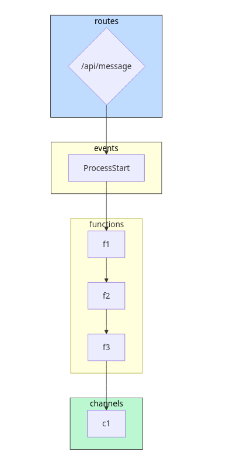
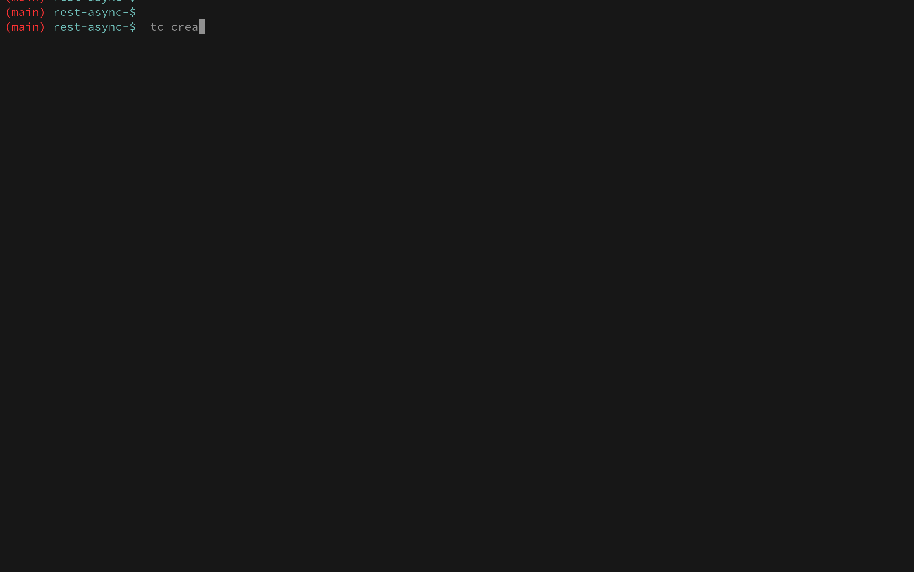
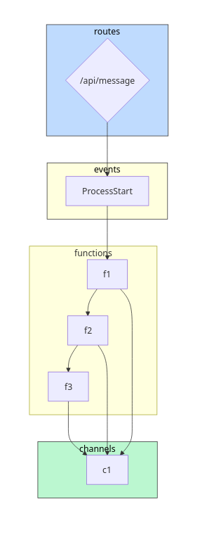
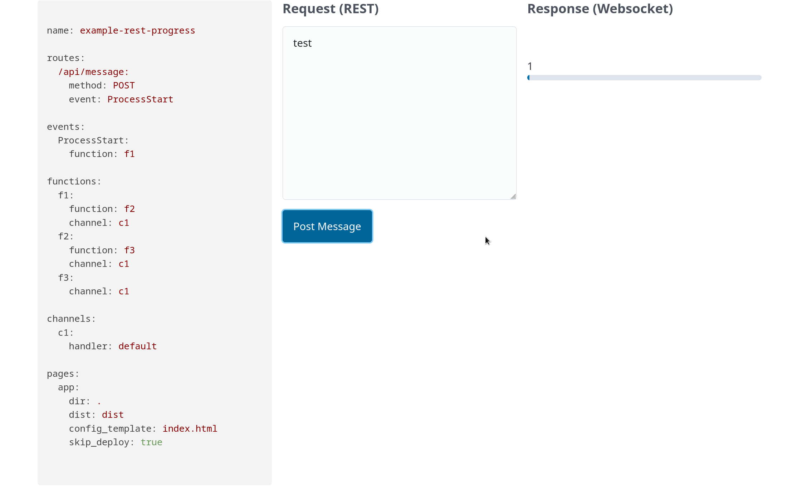

In the Hello World example, we learned how to create a simple synchronous API request-response using a function backend. In this example, we will learn to build a REST API with asynchronous response.

## Async Response

Let's say we want our api route to trigger an Event that invokes a chain of functions (linear DAG). The output of the function is consumed by a websocket channel and eventually a HTML page using a websocket client. For the purposes of this example, we create a single html file for testing. The function implementations don't matter.

```
name: example-rest-async

routes:
  /api/message:
    method: POST
    event: ProcessStart

events:
  ProcessStart:
    function: f1

functions:
  f1:
    function: f2
  f2:
    function: f3
  f3:
    channel: c1

channels:
  c1:
    handler: default

pages:
  app:
    dir: .
    dist: dist
    config_template: index.html
    skip_deploy: true
```
Example: examples/patterns/rest-async

To visualize the topology, run:

```sh
cd examples/patterns/rest-async
tc visualize
```



Now create a sandbox of the topology

```sh
tc create -s yoda --profile dev
..
open dist/index.html
```




## Tracking Progress

Now that we have an asynchronous websocket response, can we also track the progress of the actual processing (f1 -> f2 -> f3) ? Yes, we can add a channel as an _interceptor_ to each of the functions.

```
name: example-rest-progress

routes:
  /api/message:
    method: POST
    event: ProcessStart

events:
  ProcessStart:
    function: f1

functions:
  f1:
    function: f2
    channel: c1
  f2:
    function: f3
    channel: c1
  f3:
    channel: c1

channels:
  c1:
    handler: default

pages:
  app:
    dir: .
    dist: dist
    config_template: index.html
    skip_deploy: true

```

`tc visualize` of the above topology shows the following:



Now do `tc create -s yoda --profile PROFILE` and `open dist/index.html`:



This is a simple example of how we can compose routes, events, functions and channels to create a REST API with async response and a progress bar.

## Authorization

We can either have a custom authorizer (function) or cognito (OIDC provider). If cognito, tc will create all the required user pool and app clients. It will render the Issuer, client details in the config_template of the page app and set it up for an automatic login flow using OIDC. See example in tc/examples/pattersn/rest-auth/app

```
name: example-rest-auth

routes:
  /api/message:
	authorizer: cognito
    method: POST
    event: ProcessStart

...
```

## How does the composition work ?

tc implicitly creates a _transducer_ function (lambda) for the topology and uses Lambda Destinations to orchestrate the composition on AWS. The _transducer_ is topology-aware and can resolve the input/output format given the name of the entity. It also resolves all the required permissions, keys, target hosts thereby keeping the composition abstract and pure.
