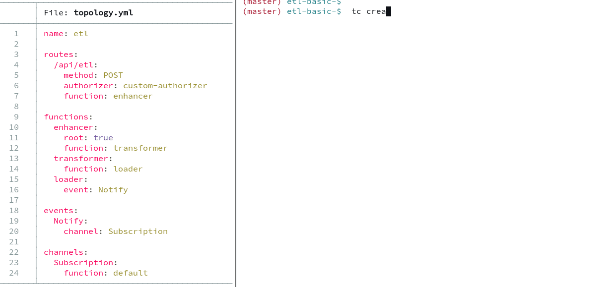

Download the executable for your OS

| GNU/Linux x86                                                                   | MacOSX M1/M2                                                       |
|---------------------------------------------------------------------------------|--------------------------------------------------------------------|
| [0.9.35](https://github.com/tc-functors/tc/releases/download/0.9.35/tc-x86_64-linux) | [0.9.35](https://github.com/tc-functors/tc/releases/download/0.9.35/tc-aarch64-macos)


:::note

For Mac Users:

sudo mv ~/Downloads/tc /usr/local/bin/tc

sudo chmod +x /usr/local/bin/tc

The first time you run the downloaded executable you will get a popup that says it may be "malicious software"

Do the following:
* Go to `Privacy & Security` panel to the `Security/Settings` section
* Should have `App Store and identified developers` selected
* Where it says `tc was blocked from use becasue it is not from an identified developer`
    * Click on `Allow Anyway`

:::


## Upgrading

To upgrade tc, we can just do:

```
tc upgrade
```

or downgrade/upgrade to specific version

```
tc upgrade --version 0.8.102
```


## Building your own

`tc` is written in [Rust](https://www.youtube.com/watch?v=ul9vyWuT8SU).

If you prefer to build `tc` yourself, install rustc/cargo.

Install Cargo/Rust https://www.rust-lang.org/tools/install

```sh
git clone https://github.com/tc-functors/tc.git
cd tc
cargo build --release
sudo mv target/release/tc /usr/local/bin/tc
```

tc is primarily a CLI app. It has an built-in [HTMX-based Inspector UI](/extras/inspector/), a local emulator and a Lisp interpreter.

The CLI app provides a core set of commands to manage the lifecycle of sandboxed topologies.

```
Usage: tc <COMMAND>

Commands:
  build     Build layers, image trees, extensions and pack function code
  compose   Compose a Topology
  create    Create a sandboxed topology
  delete    Delete a sandboxed topology
  freeze    Freeze a sandbox and make it immutable
  invoke    Invoke a topology synchronously or asynchronously
  prune     Prune all resources in given sandbox
  resolve   Resolve a topology
  snapshot  Snapshot given sandbox
  test      Run tests in topology
  tag       Create semver tags scoped by a topology
  unfreeze  Unfreeze a sandbox and make it mutable
  update    Update entity and components
  upgrade   Upgrade tc version
  version   display current tc version
```

<br/>


