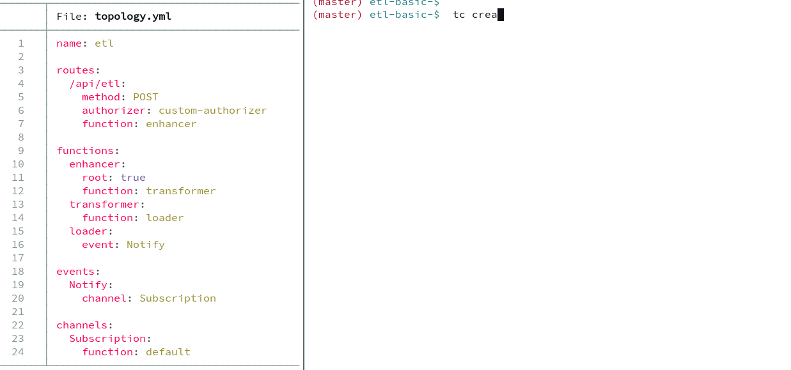

Download the executable for your OS

| GNU/Linux x86                                                                   | MacOSX M1/M2                                                       |
|---------------------------------------------------------------------------------|--------------------------------------------------------------------|
| [0.9.127](https://github.com/tc-functors/tc/releases/download/0.9.127/tc-x86_64-linux) | [0.9.127](https://github.com/tc-functors/tc/releases/download/0.9.127/tc-aarch64-macos)


:::note

For Mac Users:

sudo mv ~/Downloads/tc /usr/local/bin/tc

sudo chmod +x /usr/local/bin/tc

The first time you run the downloaded executable you will get a popup that says it may be "malicious software"

Do the following:
* Go to `Privacy & Security` panel to the `Security/Settings` section
* Should have `App Store and identified developers` selected
* Where it says `tc was blocked from use becasue it is not from an identified developer`
    * Click on `Allow Anyway`

:::


## Upgrading

To upgrade tc, we can just do:

```
tc upgrade
```

or downgrade/upgrade to specific version

```
tc upgrade --version 0.8.102
```


## Building your own

`tc` is written in [Rust](https://www.youtube.com/watch?v=ul9vyWuT8SU).

If you prefer to build `tc` yourself, install rustc/cargo.

Install Cargo/Rust https://www.rust-lang.org/tools/install

```sh
git clone https://github.com/tc-functors/tc.git
cd tc
cargo build --release
sudo mv target/release/tc /usr/local/bin/tc
```

tc is primarily a CLI app.

The CLI app provides a core set of commands to manage the lifecycle of sandboxed topologies.

```
Usage: tc <COMMAND>

Commands:
  build      Build layers, extensions and pack function code
  changelog  Generate changelog for topology
  compile    Compile Topology Spec
  compose    Compose a Topology
  create     Create a sandboxed topology
  delete     Delete a sandboxed topology
  diff       Diff Sandboxe and local state
  emulate    Emulate a topology or entity
  freeze     Freeze a sandbox and make it immutable
  invoke     Invoke a topology synchronously or asynchronously
  list       List resources in a topology
  mcp        Run MCP server
  prune      Prune all resources in given sandbox
  resolve    Resolve a topology
  route      Route traffic to the given sandbox
  run        Run arbitrary task in function dirs
  scaffold   Scaffold functions and topology using LLM
  snapshot   Snapshot of current sandbox and env
  test       Run tests in topology
  tag        Create semver tags scoped by a topology
  unfreeze   Unfreeze a sandbox and make it mutable
  update     Update entity and components
  upgrade    upgrade tc version
  version    display current tc version
  visualize  Visualize topology using HTML
```

<br/>


