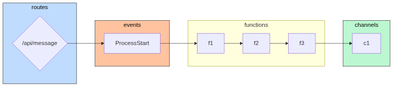

The composer generates various output formats to visualize or inspect the topology.

```
tc compose -f <format>
```

The following are some available formats
1. json
2. table
3. tree
4. digraph
5. mermaid
6. structurizr

Let's try various formats in examples/patterns/rest-async-progress directory.

### Tree

```
tc compose -f tree

example-rest-progress
├╌╌ functions
┆   ├╌╌ f3
┆   ┆   ├╌╌ f3
┆   ┆   ├╌╌ fqn: example-rest-progress_f3_{{sandbox}}
┆   ┆   ├╌╌ role: tc-base-function-{{sandbox}}
┆   ┆   ├╌╌ uri: examples/patterns/rest-async-progress/f3/lambda.zip
┆   ┆   └╌╌ build: code
┆   ├╌╌ f2
┆   ┆   ├╌╌ f2
┆   ┆   ├╌╌ fqn: example-rest-progress_f2_{{sandbox}}
┆   ┆   ├╌╌ role: tc-base-function-{{sandbox}}
┆   ┆   ├╌╌ uri: examples/patterns/rest-async-progress/f2/lambda.zip
┆   ┆   └╌╌ build: code
┆   └╌╌ f1
┆       ├╌╌ f1
┆       ├╌╌ fqn: example-rest-progress_f1_{{sandbox}}
┆       ├╌╌ role: tc-base-function-{{sandbox}}
┆       ├╌╌ uri: examples/patterns/rest-async-progress/f1/lambda.zip
┆       └╌╌ build: code
├╌╌ events
┆   └╌╌ ProcessStart
└╌╌ routes
    └╌╌ /api/message
```

### Table

```
tc compose -f table
 entity   | name | target_entity | target_name
----------+------+---------------+-------------
 function | f1   | function      | f2
 function | f1   | channel       | c1
 function | f3   | channel       | c1
 function | f2   | function      | f3
 function | f2   | channel       | c1
```

### Digraph

We can generate the topology as digraph.

```
tc compose -f digraph

digraph {
    0 [ label = "\"f2\"" ]
    1 [ label = "\"f1\"" ]
    2 [ label = "\"ProcessStart\"" ]
    3 [ label = "\"f3\"" ]
    4 [ label = "\"/api/message\"" ]
    1 -> 0 [ ]
    0 -> 3 [ ]
    4 -> 2 [ ]
    2 -> 1 [ ]
}
```

To visualize digraph using dot/graphviz

```
tc compose -f digraph | dot -Tpng > ~/dot.png

# or via stdin

tc compose -f dot |dot -Tpng | feh -
```


### Mermaid

To output mermaid flowchart

```
tc compose -f mermaid
```
```
 tc compose -f mermaid

flowchart LR

subgraph routes
	route__api_message{/api/message}
end
subgraph events
	ProcessStart
end
subgraph functions
	f2
	f1
	f3
end
subgraph channels
	c1
end

route__api_message{/api/message}-->ProcessStart

ProcessStart-->f1
f2-->f3
f1-->f2
f3-->c1
```

To visualize the generated mermaid, install [mermaid-cli](https://github.com/mermaid-js/mermaid-cli)

```
npm install -g @mermaid-js/mermaid-cli
```

```sh
tc compose -f mermaid |  mmdc --input - -o output.png
```




### Structurizr

To generate structurizr output

```
tc compose -f structurizr
```
