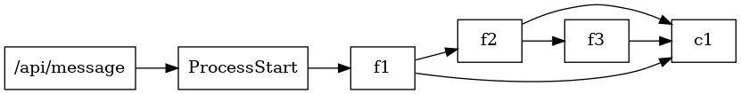

The composer generates various output formats to visualize or inspect the topology.

```
tc compose -f <format>
```

The following are some available formats
1. json
2. table
3. tree
4. digraph
5. ascii graph
5. icepanel

Let's try various formats in examples/patterns/rest-async-progress

### Tree

```
tc compose -f tree

example-rest-progress
├╌╌ functions
┆   ├╌╌ f3
┆   ┆   ├╌╌ f3
┆   ┆   ├╌╌ fqn: example-rest-progress_f3_{{sandbox}}
┆   ┆   ├╌╌ role: tc-base-function-{{sandbox}}
┆   ┆   ├╌╌ uri: examples/patterns/rest-async-progress/f3/lambda.zip
┆   ┆   └╌╌ build: code
┆   ├╌╌ f2
┆   ┆   ├╌╌ f2
┆   ┆   ├╌╌ fqn: example-rest-progress_f2_{{sandbox}}
┆   ┆   ├╌╌ role: tc-base-function-{{sandbox}}
┆   ┆   ├╌╌ uri: examples/patterns/rest-async-progress/f2/lambda.zip
┆   ┆   └╌╌ build: code
┆   └╌╌ f1
┆       ├╌╌ f1
┆       ├╌╌ fqn: example-rest-progress_f1_{{sandbox}}
┆       ├╌╌ role: tc-base-function-{{sandbox}}
┆       ├╌╌ uri: examples/patterns/rest-async-progress/f1/lambda.zip
┆       └╌╌ build: code
├╌╌ events
┆   └╌╌ ProcessStart
└╌╌ routes
    └╌╌ /api/message
```

### Table

```
tc compose -f table
 entity   | name | target_entity | target_name
----------+------+---------------+-------------
 function | f1   | function      | f2
 function | f1   | channel       | c1
 function | f3   | channel       | c1
 function | f2   | function      | f3
 function | f2   | channel       | c1
```

### Digraph

We can generate the topology as digraph.

```
tc compose -f digraph

digraph {
    0 [ label = "\"f2\"" ]
    1 [ label = "\"f1\"" ]
    2 [ label = "\"ProcessStart\"" ]
    3 [ label = "\"f3\"" ]
    4 [ label = "\"/api/message\"" ]
    1 -> 0 [ ]
    0 -> 3 [ ]
    4 -> 2 [ ]
    2 -> 1 [ ]
}
```

To visualize digraph using dot/graphviz

```
tc compose -f digraph | dot -Tpng > ~/dot.png

# or via stdin

tc compose -f dot |dot -Tpng | feh -
```



### ASCII graph


```
tc compose -f ascii
```


### Icepanel

```sh
tc compose -f icepanel
```

```json
{
  "modelObjects": [
    {
      "id": "example-rest-progress",
      "name": "example-rest-progress",
      "tagIds": [
        "tag-external"
      ],
      "type": "domain"
    },
    {
      "id": "example-rest-progress_f1",
      "name": "f1",
      "parentId": "example-rest-progress",
      "tagIds": [
        "tag-external"
      ],
      "type": "app"
    },
    {
      "id": "example-rest-progress_f2",
      "name": "f2",
      "parentId": "example-rest-progress",
      "tagIds": [
        "tag-external"
      ],
      "type": "app"
    },
    {
      "id": "example-rest-progress_f3",
      "name": "f3",
      "parentId": "example-rest-progress",
      "tagIds": [
        "tag-external"
      ],
      "type": "app"
    }
  ]
}
```
