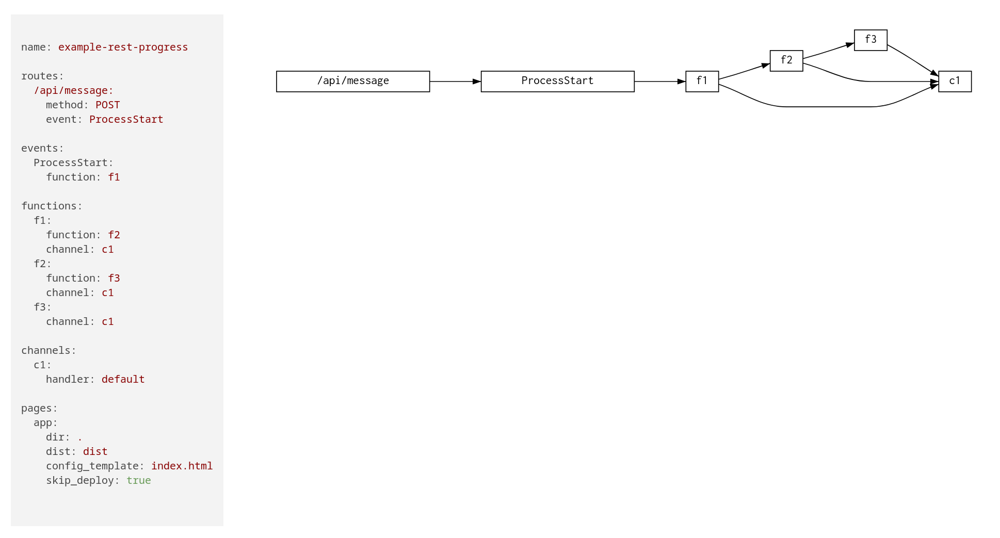

The composer generates various output formats to visualize or inspect the topology.

```
tc compose -f <format>
```

The following are some available formats
1. json
2. table
3. tree
4. digraph
5. icepanel

Let's try various formats in examples/patterns/rest-async-progress

```
tc compose -f tree

example-rest-progress
├╌╌ functions
┆   ├╌╌ f3
┆   ┆   ├╌╌ f3
┆   ┆   ├╌╌ fqn: example-rest-progress_f3_{{sandbox}}
┆   ┆   ├╌╌ role: tc-base-function-{{sandbox}}
┆   ┆   ├╌╌ uri: examples/patterns/rest-async-progress/f3/lambda.zip
┆   ┆   └╌╌ build: code
┆   ├╌╌ f2
┆   ┆   ├╌╌ f2
┆   ┆   ├╌╌ fqn: example-rest-progress_f2_{{sandbox}}
┆   ┆   ├╌╌ role: tc-base-function-{{sandbox}}
┆   ┆   ├╌╌ uri: examples/patterns/rest-async-progress/f2/lambda.zip
┆   ┆   └╌╌ build: code
┆   └╌╌ f1
┆       ├╌╌ f1
┆       ├╌╌ fqn: example-rest-progress_f1_{{sandbox}}
┆       ├╌╌ role: tc-base-function-{{sandbox}}
┆       ├╌╌ uri: examples/patterns/rest-async-progress/f1/lambda.zip
┆       └╌╌ build: code
├╌╌ events
┆   └╌╌ ProcessStart
└╌╌ routes
    └╌╌ /api/message
```


```
tc compose -f table
 entity   | name | target_entity | target_name
----------+------+---------------+-------------
 function | f1   | function      | f2
 function | f1   | channel       | c1
 function | f3   | channel       | c1
 function | f2   | function      | f3
 function | f2   | channel       | c1
```

We can also visualize the topology as dot SVG in a standalone HTML page by running `tc visualize` in the topology dir.


