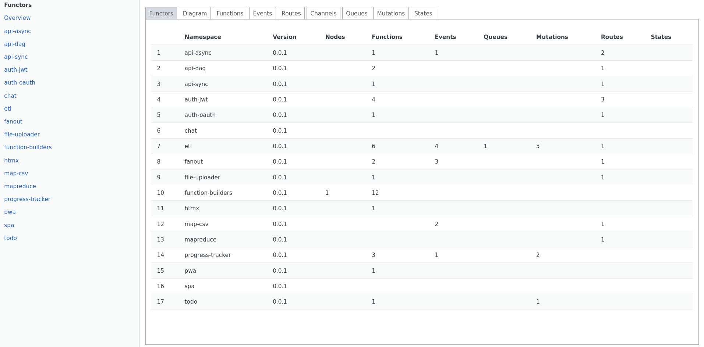
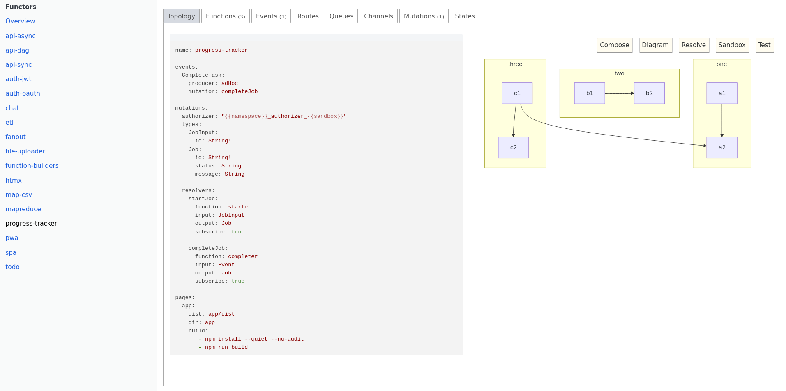

Download inspector from https://github.com/tc-functors/inspector

By default, `inspector` uses SurrealDB in-memory mode.

```sh
cd topology-dir
tc-inspector --port 8080

=> http://localhost:8080
```



