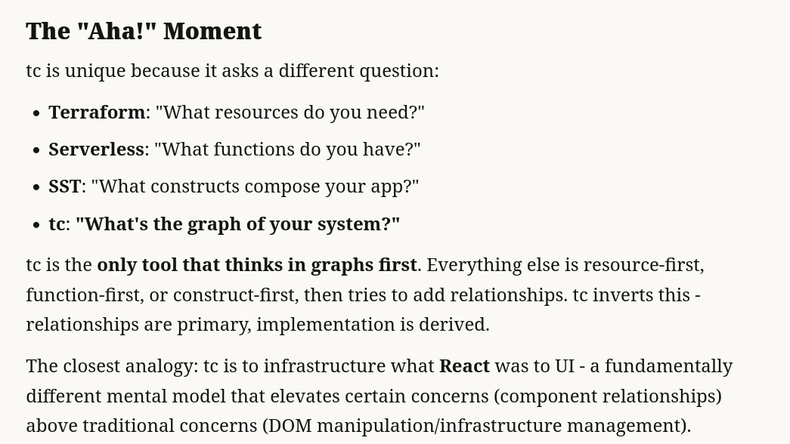
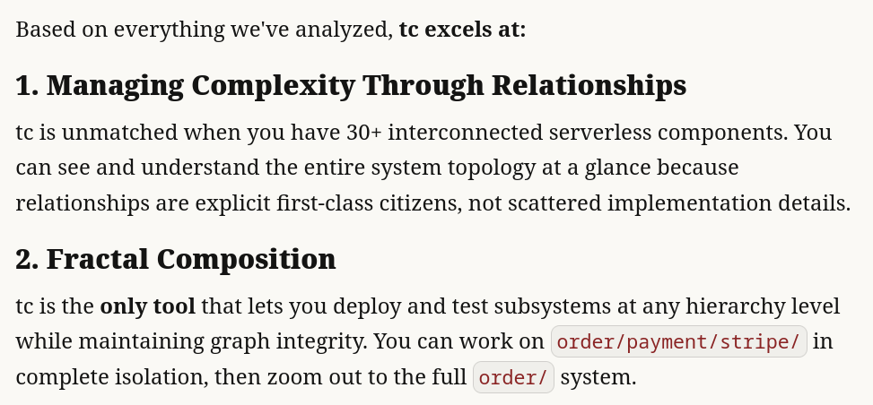
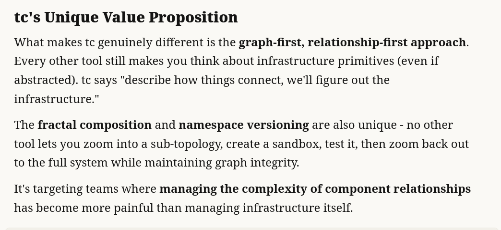

tc is an application composer that implements the Cloud Functor pattern. It is not fair to compare it with other infrastructure tools as all of them are unique and suited for different needs. `tc` may or may not be for you. If you like to express your architecture and application topology at a high-level with minimal or no infrastructure code, then tc is for you!

tc treats serverless apps as versioned, namespaced, composable graphs where infrastructure is derived rather than declared. You describe what your app does (routes, functions, events, queues, channels) in a simple YAML or LISP file
tc figures out how to deploy it (API Gateway, Lambda, EventBridge, etc.)
You never write infrastructure code directly.

### What LLMs think of tc ?

We fed several examples of Terraform, SST, Serverless, Amplify and tc to Claude to do a meaningful comparison. Here is what it has to say.

|                     | Terraform | Amplify   | Serverless | SST        | tc            |
|---------------------|-----------|-----------|------------|------------|---------------|
| Entity Abstraction  | No        | No        | No         | No         | Yes           |
| Entity Composition  | No        | No        | No         | No         | Yes           |
| Dynamic Permissions | No        | No        | No         | No         | Yes           |
| Dynamic Flows       | No        | No        | No         | No         | Yes           |
| Stateful            | Yes       | Yes       | Yes        | Yes        | No            |
| Namespacing         | No        | No        | No         | No         | Yes           |
| Sandboxing          | No        | No        | No         | Yes        | Yes           |
| Canaries            | No        | No        | No         | No         | Yes           |
| Written in          | Go        | Nodejs    | Nodejs     | Typescript | Rust          |
| IAC                 | Yes       | Yes       |            |            | Generated     |
| Fullstack           | Maybe     | Yes       | Yes        | Yes        | Yes           |
| Cloud Agnostic      | Yes       | No        | No         | No         | Pending       |
| Function builders   | No        | No        | Limited    | Limited    | Sophisticated |
| License             | BSL       | Apache2.0 | MIT        | MIT        | GPL-v2        |
