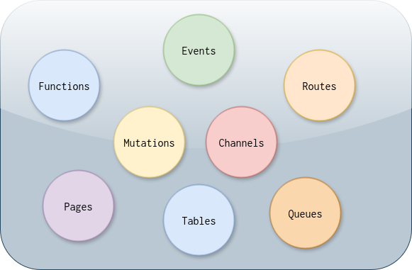

> “The purpose of abstraction is not to be vague, but to create a new semantic level in which one can be absolutely precise.” -  Edsger W. Dijkstra

tc implements the Cloud Function Pattern. tc compiles a tree of entities defined in the filesystem as a topology. This composable, namespaced, sandboxed, recursive, versioned and isomorphic topology is called a `Cloud Functor`.
A Cloud Functor has 3 core concepts: Entity Abstraction, Namespacing and Composition.

**Entity Abstraction**



Entities can be thought of like atoms. They are core cloud primitives which abstract away all the low-level details. Entities are defined in a cloud-agnostic way. tc provides eight entities that are sufficient to build sophisticated serverless topologies.


**Namespacing**

The above entities can be namespaced arbitrarily - typically domain-specific. Namespaces can be thought of modules in a programming language or molecules comprising of atoms.


**Composition**

tc provides a simple mechanism to define and connect these namespaced entities as a graph and thus the use of word topology. As a result of entity composition, tc can infer the infrastrucuture permissions etc and render it in arbitrary sandboxes thus enabling sophisticated workflows.

## Namespacing

Consider the following directory structure:

```
app1/
  - authorizer
  - handler
  - notifier
  - topology.yml

app2/
  - authorizer
  - handler
  - notifier
  - topology.yml
```

The directory structures look identical, yet they are different - their handler logic is different. app1 and app2 are separate apps and have lifecycle on their own.

The respective topology files are as follows:

```yaml
name: app1

routes:
  /api:
    authorizer: authorizer
    function: handler
    event: ApiEvent

events:
  ApiEvent:
    function: notifier
```

and

```yaml
name: app2

routes:
  /api:
    authorizer: authorizer
    function: handler
    event: ApiEvent

events:
  ApiEvent:
    function: notifier
```

Most providers, particularly AWS, do not have a concept of namespace for various entities. tc disambiguates the entity names by prefixing it with the namespace string. This then allows us to treat all entities in a namespace as one unit with shared metadata. This metadata is futher used to infer permissions, sane defaults etc.


## Composition

Once we namespace, the entities can be composed in various ways.
Consider the following topology definition:

```yaml

name: example

routes:
  /api/posts:
    method: GET
    function: bar
    event: MyEvent

events:
  MyEvent:
    function: foo
    channel: room1

channels:
  room1:
    function: default

functions:
  foo:
    uri: github.com/bar/bar
  bar:
    uri: ../bar

```

Now, `/api/posts` route calls function `bar` and generates an event `MyEvent` which are handled by functions that are locally defined (subdirectories) or remote (git repos). In this example, the event finally triggers a channel notification with the event's payload. We just defined the flow without specifying anything about infrastructure, permissions or the provider. This definition is good enough to render it in the cloud as services, as architecture diagrams and release manifests.

`tc compose` maps these entities to the provider's serverless constructs. If the provider is AWS (default), tc maps `routes` to API Gateway, events to `Eventbridge`, `functions` to either `Lambda` or `ECS Fargate`, `channels` to `Appsync Events`, `mutations` to `Appsync Graphql` and `queues` to `SQS`
