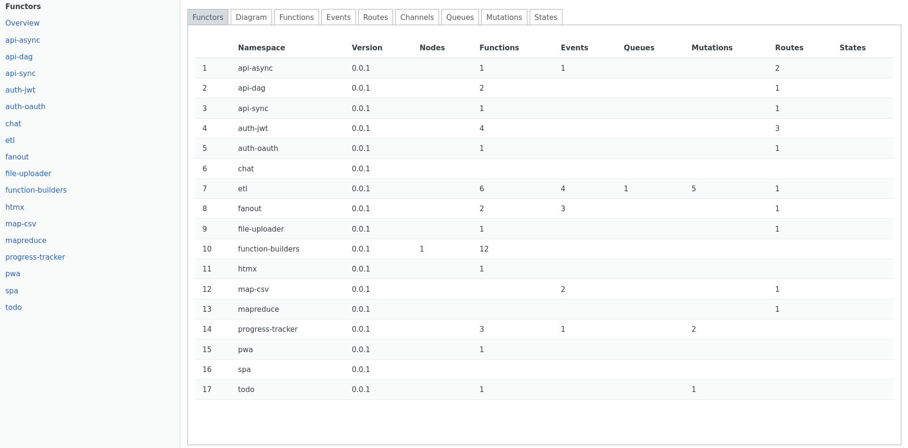
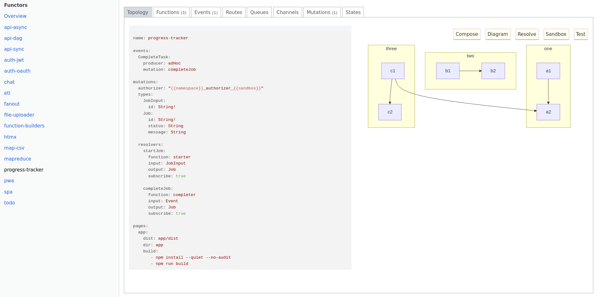

The `inspector` is an external HTMX-based web interface to inspect core tc entities in the filesystem. It also has an interface to generate topologies using LLM models specific to tc.

:::note
The inspector is not meant to be a complete web interface to tc. It is a simple UI to display and visualize all the entities and topologies in the system.
:::

By default, `inspector` uses SurrealDB in-memory mode.

### Install

```
git clone https://github.com/tc-functors/inspector.git
cd inspector
cargo build --release
sudo mv target/release/tc-inspector /usr/local/bin/tc-inspector
```


### Run


```sh
tc-inspector --port 8080

=> http://localhost:8080
```

### LLM

The inspector has a simple interface to generate topologies using pre-trained tc examples and specifications.


### Screenshots




