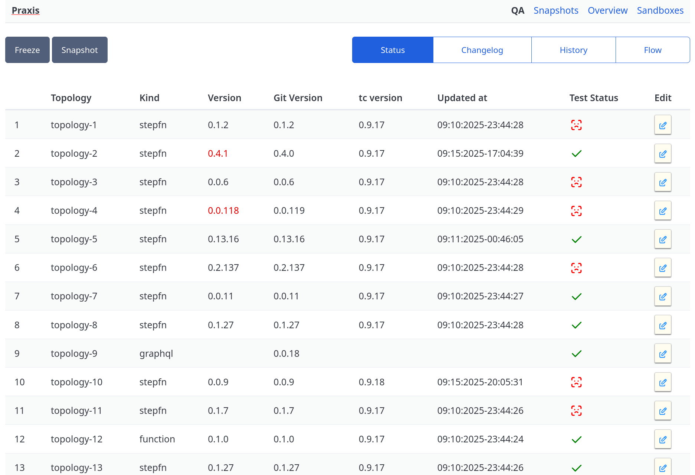
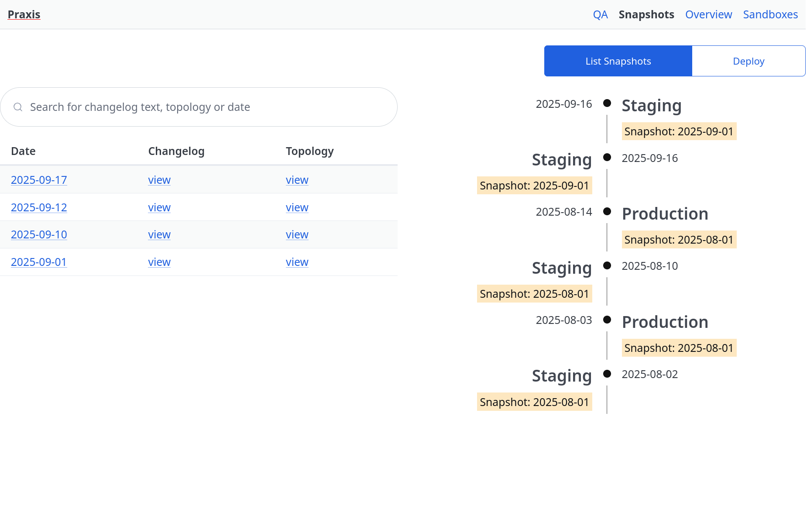

`Praxis` is a self-hostable release management UI for tc.

1. Provides an overview of all deployed topologies in the configured sandbox  (typically stable@QA)
2. Provides one-click option to deploy specific version of the topology to the sandbox
3. Provides a mechansim to freeze the entire sandbox of topologies preventing continuous deploys or updates to override it.
4. Shows changelog of all deployed topologies since previous snapshot.
5. Provides a mechanism to promote snapshots to upper enviornments (production etc)
6. Shows an audit trail and timeline of all promotions.
7. Provides a rich search interface to search snapshots for auditing.

:::note
praxis is still under development and will be made opensource soon.
:::

